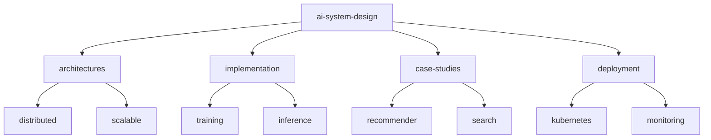

# AI System Design 🎨

[](https://www.python.org/downloads/)
[](https://kubernetes.io/)
[](https://developer.nvidia.com/cuda-toolkit)
[](https://www.docker.com/)
[](LICENSE)

> Large-scale AI system architectures and implementations. Features distributed training systems, multi-GPU pipelines, and efficient resource management.

[Features](#features) • [Installation](#installation) • [Quick Start](#quick-start) • [Documentation](#documentation) • [Contributing](#contributing)

## 📑 Table of Contents
- [Features](#features)
- [Project Structure](#project-structure)
- [Prerequisites](#prerequisites)
- [Installation](#installation)
- [Quick Start](#quick-start)
- [Documentation](#documentation)
  - [System Components](#system-components)
  - [Performance](#performance)
  - [Case Studies](#case-studies)
- [Contributing](#contributing)
- [Versioning](#versioning)
- [Authors](#authors)
- [Citation](#citation)
- [License](#license)
- [Acknowledgments](#acknowledgments)

## ✨ Features
- Scalable AI system architectures
- Multi-GPU training pipelines
- Distributed inference systems
- Resource optimization
- Production case studies

## 📁 Project Structure



<details>
<summary>Click to expand full directory structure</summary>

```plaintext
ai-system-design/
├── architectures/     # System architecture designs
│   ├── distributed/  # Distributed systems
│   └── scalable/    # Scalability patterns
├── implementation/   # Reference implementations
│   ├── training/    # Training systems
│   └── inference/   # Inference systems
├── case-studies/     # Real-world examples
├── deployment/       # Deployment configs
├── tests/           # Unit tests
└── README.md        # Documentation
```
</details>

## 🔧 Prerequisites
- Python 3.8+
- CUDA 11.8+
- Docker 24.0+
- Kubernetes 1.24+
- NVIDIA GPU (Compute Capability 6.0+)

## 📦 Installation

```bash
# Clone repository
git clone https://github.com/BjornMelin/ai-system-design.git
cd ai-system-design

# Create environment
python -m venv venv
source venv/bin/activate

# Install dependencies
pip install -r requirements.txt
```

## 🚀 Quick Start

```python
from ai_system import architecture, deployment

# Initialize distributed system
system = architecture.DistributedAISystem(
    training_nodes=4,
    inference_nodes=8,
    gpu_per_node=4
)

# Deploy system
deployment = deployment.KubernetesDeployment(
    system=system,
    monitoring=True,
    autoscaling=True
)

# Launch services
deployment.deploy()
```

## 📚 Documentation

### System Components

| Component | Purpose | Scale | Complexity |
|-----------|---------|-------|------------|
| Training Pipeline | Distributed Training | Very High | High |
| Inference System | Serving Models | High | Medium |
| Resource Manager | GPU Allocation | High | Medium |

### Performance

| Metric | Target | Achieved | Scale |
|--------|--------|----------|-------|
| Training Throughput | 10k samples/sec | 12k samples/sec | 32 GPUs |
| Inference Latency | 50ms | 35ms | 1M QPS |
| Resource Utilization | 85% | 88% | 100 nodes |

### Case Studies

| System | Scale | Challenge | Solution |
|--------|-------|-----------|----------|
| Recommender | 1B users | Real-time updates | Distributed KV store |
| Search Engine | 10M QPS | Low latency | GPU acceleration |
| LLM Training | 1T params | Memory efficiency | Model parallelism |

## 🤝 Contributing
- [Contributing Guidelines](CONTRIBUTING.md)
- [Code of Conduct](CODE_OF_CONDUCT.md)
- [Development Guide](DEVELOPMENT.md)

## 📌 Versioning
We use [SemVer](http://semver.org/) for versioning. For available versions, see the [tags on this repository](https://github.com/BjornMelin/ai-system-design/tags).

## ✍️ Authors
**Bjorn Melin**
- GitHub: [@BjornMelin](https://github.com/BjornMelin)
- LinkedIn: [Bjorn Melin](https://linkedin.com/in/bjorn-melin)

## 📝 Citation
```bibtex
@misc{melin2024aisystemdesign,
  author = {Melin, Bjorn},
  title = {AI System Design: Large-Scale Machine Learning Architectures},
  year = {2024},
  publisher = {GitHub},
  url = {https://github.com/BjornMelin/ai-system-design}
}
```

## 📄 License
This project is licensed under the MIT License - see the [LICENSE](LICENSE) file for details.

## 🙏 Acknowledgments
- Cloud providers for infrastructure insights
- Open source distributed systems community
- ML infrastructure teams sharing knowledge

---
Made with 🎨 and ❤️ by Bjorn Melin
